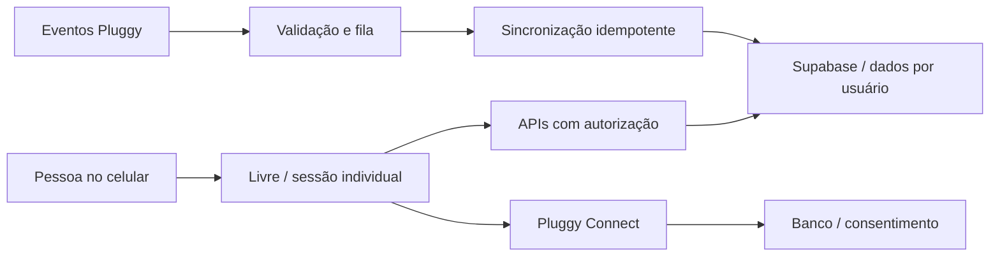

# Livre — planejamento de expansão

Data: 6 de outubro de 2026. Versão inicial para decisão de produto e implementação.

## 1. Objetivo e proposta

Transformar o aplicativo pessoal em um serviço de organização financeira para pessoas físicas, com foco no celular. A promessa inicial é: **entender quanto existe nas contas, acompanhar compromissos e organizar cartões sem planilhas**.

Público inicial sugerido: pessoas com duas ou mais contas e cartões que querem um resumo simples, sem funcionalidades de contabilidade empresarial. Validar essa hipótese com entrevistas antes de ampliar o escopo.

Começar com beta por convite, de 20 a 30 participantes, e ampliar para cerca de 100 apenas após confirmar segurança, confiabilidade e custo por usuário. Quantidades e metas deste documento são propostas, não resultados já obtidos.

## 2. Ponto de partida real

Já existem navegação mobile, modo claro/escuro, contas, lançamentos, cartões, orçamento, metas, exportação e integração pessoal com Meu Pluggy. O commit `ec53a97` acrescentou separação entre fluxo das contas e compras de cartão, identificação conservadora de transferências internas e consulta de faturas e parcelas. A nova importação ainda precisa ser validada com dados reais após publicação.

Limitações que precisam mudar antes de aceitar outros usuários:

| Área | Situação observada no código | Mudança necessária |
|---|---|---|
| Login | `lib/access.ts`, `lib/auth.ts` e `proxy.ts` restringem o acesso ao proprietário | Cadastro e sessão individual, mantendo os dados pessoais existentes |
| Identidade financeira | `lib/storage.ts` usa identidade e e-mail fixos do espaço pessoal | Obter o proprietário de cada operação pela sessão verificada |
| Backend | A função `livre-backend` recebe segredo compartilhado e usa privilégios de servidor | Separar operações de usuário e de integração; não confiar em IDs ou e-mails enviados pelo cliente |
| Banco | Tabelas possuem `user_id`, relações e políticas de acesso | Auditar as políticas aplicadas em produção e testar isolamento, inclusive nas funções privilegiadas |
| Gravação | `replace_snapshot` apaga e recria registros do usuário; leitura retorna o conjunto completo | Operações incrementais e transacionais, paginação e índices medidos com volume real |
| Open Finance | Credenciais configuradas manualmente e conector MeuPluggy 200 | Aplicação de produção e conexão no próprio Livre, conforme contrato e cobertura |
| Operação | Importação iniciada pelo usuário | Fila de sincronização, eventos, tentativas controladas e visibilidade de falhas |
| Comercial | Textos prometem recursos gratuitos e ausência de assinatura | Definir modelo e ajustar a comunicação antes de vender |

Não basta retirar o filtro de e-mail do login: isso deixaria o caminho atual apontando para o espaço financeiro pessoal.

## 3. Arquitetura proposta

Manter Next.js e Supabase inicialmente. Usar um aplicativo único, um banco compartilhado com isolamento por usuário e um serviço de sincronização separado das requisições de tela. Não criar infraestrutura de microserviços sem necessidade medida.

Fluxo principal:

Decisões técnicas propostas:

1. Usar o identificador da sessão como proprietário; validar autenticação em cada API. Não aceitar `user_id`, e-mail ou vínculo bancário arbitrário enviado pelo navegador.
2. Executar operações comuns no contexto autorizado do usuário e com RLS. Reservar credenciais privilegiadas para o processamento bancário e tarefas administrativas com escopo explícito. As chaves de serviço do Supabase ignoram RLS, portanto políticas sozinhas não protegem esse caminho. [Referência Supabase](https://supabase.com/docs/guides/database/postgres/row-level-security).
3. Vincular cada Item do Pluggy ao usuário no servidor, confirmando a criação pelo provedor. Emitir Connect Tokens de curta duração; credenciais comerciais ficam no servidor.
4. Usar chaves únicas por usuário/provedor/transação, controle de concorrência por conexão e eventos idempotentes. Um evento repetido não pode duplicar gastos.
5. Sincronizar em tarefas duráveis, com limite por usuário e provedor, retentativas com espera crescente e fila de falhas. O celular apenas inicia ou consulta a operação.
6. Preservar categorias e ajustes do usuário durante novas importações. Representar regras, recorrências e faturas em entidades próprias quando os requisitos estiverem definidos.
7. Criar ambientes separados de desenvolvimento, homologação e produção, com dados fictícios fora de produção e migrações versionadas.

## 4. Fases e critérios de conclusão

Estimativa preliminar: **10 a 14 semanas**, considerando um desenvolvedor dedicado, revisão de produto semanal e apoio externo de segurança/jurídico. Aprovação de fornecedor e contratação podem aumentar o prazo. As fases dependem dos critérios abaixo; não liberar apenas porque uma semana terminou.

| Fase | Esforço sugerido | Entregas | Critério para avançar |
|---|---|---|---|
| 0 — Viabilidade | Semana 1 | Entrevistas, público, escopo, cotação Pluggy, orçamento, revisão da hospedagem e responsabilidades de dados | Cobertura bancária e condições comerciais documentadas; orçamento autorizado |
| 1 — Base para vários usuários | Semanas 2–4 | Cadastro, login, isolamento, nova autorização nas APIs, migração segura do proprietário, escrita incremental, exportação e exclusão | Usuários A e B não acessam dados um do outro por qualquer caminho; restauração e migração ensaiadas |
| 2 — Conexão bancária comercial | Semanas 5–7 | Connect integrado, vínculo por usuário, consentimentos, fila, eventos, reconexão, diagnóstico de importação | Conectar, importar, repetir evento, falhar, recuperar e revogar funcionam com contas de teste aprovadas |
| 3 — Beta mobile | Semanas 8–10 | PWA, resumo mensal compreensível, faturas, recorrências básicas, regras de categoria, suporte e métricas mínimas | Fluxos essenciais usáveis em celular; dados consistentes; feedback de 20–30 participantes tratado |
| 4 — Venda e lançamento limitado | Semanas 11–14 | Planos, checkout, portal de assinatura, limites de conexão, atendimento e materiais comerciais | Cobrança, cancelamento, falhas de pagamento e acesso testados; custos e margem aprovados |

### Fase 0: decisões que evitam retrabalho

- Entrevistar 8–10 pessoas e observar como acompanham saldo, faturas e contas fixas.
- Escolher até cinco bancos prioritários e verificar qualidade real das informações fornecidas.
- Solicitar à Pluggy condições de produção, cobertura, quantidade de conexões, frequência de atualização, custos mínimos/variáveis, suporte, cancelamento e condições de uso. Não assumir que a integração pessoal atual pode ser distribuída comercialmente.
- Definir se a primeira versão terá plano manual gratuito e plano conectado pago. Tratar isso como hipótese de produto até conhecer os custos.
- Escolher quem responde por produto, desenvolvimento, suporte, despesas e contratos.

### Fase 1: primeiro conjunto de tarefas técnicas

- Remover dependência de identidades fixas sem alterar a titularidade do histórico existente.
- Testar as APIs e funções de banco com duas sessões: leitura, alteração, exclusão, exportação, conexão e manipulação de IDs.
- Revisar todos os endpoints, inclusive autenticação, callbacks e tarefas de servidor.
- Migrar gravações por snapshot para CRUD transacional com propriedade verificada e controle de concorrência.
- Implementar encerramento de sessão, exclusão de conta e exportação dos próprios dados.
- Fazer um backup e ensaiar restauração antes de migrar produção.

### Fase 2: operação bancária confiável

- Substituir cópia manual de Item IDs por conexão dentro do Livre.
- Mostrar estado da conexão, última coleta do provedor e última importação no Livre separadamente.
- Tratar duplicatas, estornos, troca de IDs, eventos fora de ordem, parcelas e dados parciais.
- Exibir claramente quando valores são conhecidos, estimados ou indisponíveis; nunca transformar dado ausente em saldo zero.
- Implementar revogação/desconexão com explicação sobre dados mantidos e consentimento bancário.
- Definir política de atualização conforme contrato; a documentação informa que auto-sync é uma funcionalidade de aplicações Production. [Referência Pluggy](https://docs.pluggy.ai/en/docs/connections/item).

### Fase 3: produto mobile enxuto

- Instalação na tela inicial, navegação inferior, carregamento rápido e estados de erro compreensíveis.
- Cache de arquivos públicos da interface; evitar cache compartilhado de dados financeiros e limpar dados locais de sessão ao sair.
- Contas fixas/assinaturas como compromissos previstos, sem misturá-los aos lançamentos importados. Pagamento confirmado deve conciliar a previsão, não criar outra despesa.
- Regras simples de categoria por descrição, restritas a cada usuário, com possibilidade de corrigir ou desfazer.
- Visão de próximos vencimentos e projeção de sobra baseada nos compromissos cadastrados, explicitamente identificada como estimativa.
- Não condicionar o beta a aplicativo nativo, inteligência artificial, investimentos ou compartilhamento familiar.

### Fase 4: cobrança

- Um plano pago inicial, com limites simples de bancos conectados e frequência de atualização.
- Cobrança e direitos de acesso controlados no servidor, com eventos idempotentes do gateway.
- Regras para renovação, cancelamento, inadimplência, reembolso e mudança de plano definidas antes do lançamento.
- Rever mensagens como “100% gratuito” e “sem assinatura” se o produto passar a cobrar.

## 5. Custos e modelo comercial

Não definir preço final antes da proposta do provedor. A documentação da Vercel limita Hobby a uso pessoal não comercial; para uso comercial, planejar Pro ou outro serviço com condições adequadas. [Política Vercel](https://vercel.com/docs/limits/fair-use-guidelines).

| Categoria | O que levantar | Tipo de custo |
|---|---|---|
| Open Finance | Base contratual, conexões, chamadas/atualizações, excedentes e suporte | Fixo e variável, conforme cotação |
| Hospedagem | Plano comercial, funções, tráfego e ambientes | Fixo e consumo |
| Banco de dados | Armazenamento, computação, backup e recuperação | Fixo e consumo |
| Operação | Fila, monitoramento, e-mail e domínio | Fixo e consumo |
| Venda | Gateway, impostos, devoluções e suporte por cliente | Variável e equipe |
| Implantação | Desenvolvimento, revisão de segurança e documentação jurídica | Inicial e manutenção |

Cenários de capacidade para cotação, sem presumir a unidade de cobrança do provedor:

| Usuários conectados | Média de bancos por usuário | Conexões ativas | Atualizações/mês se cada conexão atualizar 1 vez/dia |
|---:|---:|---:|---:|
| 30 | 2 | 60 | 1.800 |
| 100 | 2 | 200 | 6.000 |
| 1.000 | 2 | 2.000 | 60.000 |

Atualizações não equivalem necessariamente a chamadas de API nem a unidades faturadas. Medir chamadas por importação, falhas e repetições e confirmar como o fornecedor cobra.

Modelo de decisão: custo mensal = custos fixos + consumo do provedor + infraestrutura variável + taxas + suporte. Calcular margem por usuário pagante e o custo de sustentar usuários gratuitos. Propor preço e limites apenas depois dessa conta e de entrevistas sobre disposição a pagar.

## 6. Privacidade, segurança e atendimento

Preparar um inventário de dados e fornecedores, finalidade de cada coleta, prazo de retenção, política de exclusão e canal de atendimento. Definir papéis e revisar base legal, contratos e aviso de privacidade com apoio jurídico antes do beta externo. Usar as orientações oficiais de segurança da ANPD como referência; não presumir enquadramento ou dispensa pelo tamanho inicial. [Guia ANPD](https://www.gov.br/anpd/pt-br/centrais-de-conteudo/materiais-educativos-e-publicacoes/guia-orientativo-sobre-seguranca-da-informacao-para-agentes-de-tratamento-de-pequeno-porte).

Medidas do projeto: segredos apenas no servidor, administração com autenticação reforçada, logs sem credenciais/CPF/extratos, registro de ações administrativas, acesso de suporte restrito, alertas de falha e procedimento de incidente. Testar exclusão local e revogação no provedor como operações distintas. Definir retenção de backups e comunicar os prazos.

O Livre deve permanecer um serviço de organização financeira nesta etapa. Transferências de dinheiro, concessão de crédito e recomendações personalizadas de investimento ficam fora do escopo e exigiriam avaliação própria.

## 7. Métricas do beta e decisões de expansão

Metas propostas para discussão, medidas por coorte e com amostra identificada:

| Métrica | Meta inicial proposta | Decisão que orienta |
|---|---|---|
| Isolamento | Todos os testes de acesso cruzado bloqueados; nenhum defeito conhecido | Obrigatório antes de convidar pessoas |
| Ativação | Pelo menos 70% conectam um banco e entendem o resumo | Melhorar entrada/conexão se não atingir |
| Confiabilidade | Pelo menos 95% das tarefas de importação concluídas, separando falhas do provedor | Corrigir operação antes de ampliar convites |
| Retenção | Pelo menos 50% retornam na quarta semana | Validar utilidade antes de investir em aquisição |
| Suporte | Medir motivos, tempo de resolução e atendimentos por usuário | Simplificar produto e dimensionar operação |
| Custo | Consumo por conexão/usuário medido e margem aprovada | Autorizar preço e limites do plano |

Medir eventos de uso sem enviar nomes de bancos, descrições de transação, valores financeiros ou identificadores pessoais a ferramentas de análise por padrão.

## 8. Riscos e limites de lançamento

| Risco | Tratamento | Bloqueia lançamento? |
|---|---|---|
| Acesso aos dados de outra pessoa | Sessão individual, escopo nas APIs, RLS e testes com usuários diferentes | Sim |
| Custo bancário maior que receita | Cotação, limites, orçamento e alerta de consumo | Sim para venda |
| Banco fornece dados incompletos | Data de atualização, avisos, dados manuais separados e reconexão | Se comprometer a promessa principal |
| Duplicação de registros | Idempotência, reconciliação e testes por banco | Sim |
| Perda de histórico ao migrar | Backup, ensaio e migração com verificação | Sim |
| Suporte não acompanha crescimento | Convites em lotes e limite de participantes | Sim para ampliar o lote |

## 9. Próxima decisão

Autorizar primeiro a **fase 0 e a revisão da arquitetura para múltiplos usuários**, preservando a operação pessoal atual. Ao final, revisar proposta comercial, orçamento, cobertura bancária e backlog da fase 1. Não abrir o cadastro público nem alterar produção durante a elaboração desse planejamento.

Este documento não contrata serviços, não ativa cobrança e não autoriza publicação ou migração por si só.
